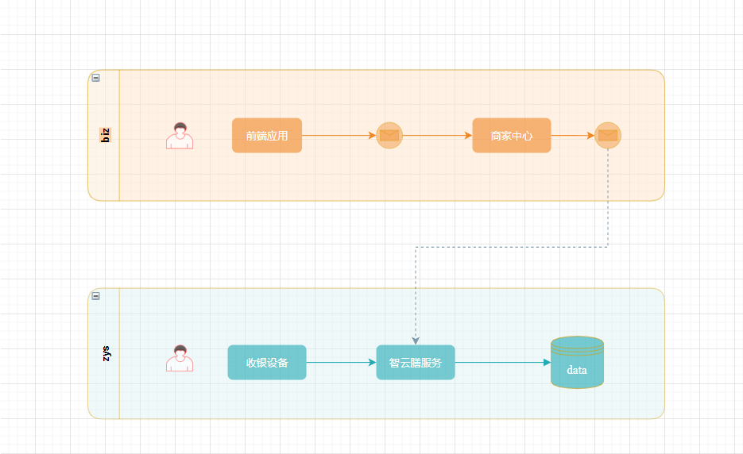

# 上下游系统不可用

## 介绍

在分布式系统中，一个调用链路上可能会涉及多个业务系统。如下图（此图以部分链路举例）。 在增加新功能时，可能链路中的多个业务系统，开发完成时间不同步，服务不能随时提供，如果己方是服务调用方，那这时要如何测试业务保障代码没有问题？如果己方是服务提供方，那又要怎么保证服务是可用的？针对这些问题，本节将介绍，在这些场景下如何去做单元测试。




## 业务场景

### 上游系统不可用

以上图举例，智云膳系统需要接收商家中心传来的基础数据，智云膳保存数据后，用户才能在收银设备上登录。以收银用户登录的系统为基准，那么此时，智云膳系统就位商家中心的上游。如果此时智云膳接收数据的接口还未开发完成，那商家中心要怎么进行测试呢？

#### 演示 [Demo](https://github.com/xiyun-international/java-unit-docs/tree/master/source/middle-stage-test-unavailable)

##### Service 代码

此处业务为商家中心获取推送数据后发送 HTTP 请求到智云膳系统。

```java
@Slf4j
@Service
public class ShopServiceImpl implements ShopService {


    @Autowired
    private PushDataMapper pushDataMapper;
    @Autowired
    private ShopMapper shopMapper;
    private HttpClientUtil httpClientUtil;

    private String url = "http://127.0.0.1:6666/:";

    public ShopServiceImpl(PushDataMapper pushDataMapper, ShopMapper shopMapper, HttpClientUtil httpClientUtil) {
        this.pushDataMapper = pushDataMapper;
        this.shopMapper = shopMapper;
        this.httpClientUtil = httpClientUtil;
    }

    public ShopServiceImpl() {

    }

    @Override
    public CallResult pushData() {

        PushData pushData = pushDataMapper.selectLately();
        if (pushData == null) {
            return CallResult.success(CallResult.RETURN_STATUS_OK, "没有可以推送的数据", null);
        }
        ShopDO shopDO = shopMapper.selectById(pushData.getObjectId());

        CallResult callResult = null;
        try {
            String result = httpClientUtil.sendHttpPost(url, JSONObject.toJSONString(shopDO));
            callResult = new CallResult(CallResult.RETURN_STATUS_OK, "调用成功", result);
        } catch (Exception e) {
            callResult = new CallResult(CallResult.RETURN_STATUS_FAIL, "推送数据失败！");
            log.error("推送数据失败  callResult = [{}]", callResult, e);
        }
        return callResult;
    }
}
```


##### 测试代码

假定智云膳系统此时不可用，通过模拟 HTTP 请求结果来测试推送业务 ，不论是RPC接口还是 HTTP 请求，只要给出接口定义，万物皆可模拟（ps : static、final、private除外）。

```java
@Slf4j
@SpringBootTest
class MiddleStageTestUnavailableApplicationTests {

    @Mock
    private PushDataMapper pushDataMapper;
    @Mock
    private ShopMapper shopMapper;
    @Mock
    private HttpClientUtil httpClientUtil;
    @InjectMocks
    private ShopServiceImpl shopService;
    private static PushData pushData;
    private static ShopDO shopDO;
    private static Integer objectId = 123;
    private String url = "http://127.0.0.1:6666/:";
    private String httpResult = "ok";

    @BeforeAll
    static void beforePushDataTest() {
        pushData = new PushData();
        pushData.setObjectId(objectId);
        pushData.setObjectType(1);

        shopDO = new ShopDO();
        shopDO.setShopId(objectId);
        shopDO.setShopName("zyq");
    }

    @Test
    void pushDataTest() throws Exception {

        when(pushDataMapper.selectLately()).thenReturn(pushData);
        when(shopMapper.selectById(objectId)).thenReturn(shopDO);
        when(httpClientUtil.sendHttpPost(url, JSONObject.toJSONString(shopDO))).thenReturn(httpResult);

        CallResult callResult = shopService.pushData();

        verify(pushDataMapper).selectLately();
        verify(shopMapper).selectById(objectId);
        verify(httpClientUtil).sendHttpPost(url, JSONObject.toJSONString(shopDO));

        Assertions.assertEquals(CallResult.RETURN_STATUS_OK, callResult.getCode());
        Assertions.assertEquals(callResult.getContent(), httpResult);
        log.info("[测试通过]");

    }
}
```


##### 运行结果

```java
2020-03-13 16:18:21.651  INFO 5816 --- [main] ddleStageTestUnavailableApplicationTests : [测试通过]
```


### 下游系统不可用

以上图举例，如果此时商家中心发送数据的业务还未开发完成，那智云膳要怎么保证服务可用？

#### 演示 [Demo](https://github.com/xiyun-international/java-unit-docs/tree/master/source/middle-stage-test-unavailable)

##### Controller 代码

此处代码为智云膳侧接收商家中心推送数据。

```java
@RestController
public class ApiShopController {

    @PostMapping("/shop/save")
    @ResponseBody
    public CallResult shopSave(@RequestBody ShopDO shopDO) {
        if (shopDO == null) {
            return CallResult.fail(CallResult.RETURN_STATUS_PARAM_ERROR, "参数异常，请检查参数！");
        }
        return CallResult.success(CallResult.RETURN_STATUS_OK, "数据保存成功", JSONObject.toJSONString(""));
    }
}
```


##### 测试代码

此处还是采用 MockMvc 对象。模拟商家中心推送的门店数据来测试接口的可用性。如果想最大限度保证接口可用，可针对接口做[边界条件测试](https://baike.baidu.com/item/%E8%BE%B9%E7%95%8C%E6%9D%A1%E4%BB%B6%E6%B5%8B%E8%AF%95/1924335?fr=aladdin)及异常测试（输入错误数据，测试程序能否正常运行）。

```java
@Slf4j
@SpringBootTest
@AutoConfigureMockMvc
class ApiShopControllerTest {

    @Autowired
    private MockMvc mockMvc;
    static ShopDO shopDO;

    @BeforeAll
    static void beforLoginTest() {
        shopDO = new ShopDO();
        shopDO.setShopId(1);
        shopDO.setShopName("zyq");
    }

    @Test
    void loginInterfaceTest() throws Exception {

        //验证测试用例是否创建
        Assertions.assertNotNull(shopDO, "shopDO is null");

        MockHttpServletResponse response = mockMvc.perform(MockMvcRequestBuilders.post("/shop/save")
                .contentType(MediaType.APPLICATION_JSON)
                .content(JSONObject.toJSONString(shopDO)))
                .andDo(MockMvcResultHandlers.print())
                .andReturn()
                .getResponse();
        //验证http状态码
        Assertions.assertNotEquals(MockMvcResultMatchers.status().isOk(), response.getStatus());
        CallResult callResult = JSONObject.parseObject(response.getContentAsString(), CallResult.class);
        //验证业务状态码
        Assertions.assertEquals(callResult.getCode(), CallResult.RETURN_STATUS_OK);

        log.info("[测试通过]");
    }
}
```


##### 运行结果

```java
MockHttpServletResponse:
           Status = 200
    Error message = null
          Headers = [Content-Type:"application/json;charset=UTF-8"]
     Content type = application/json
             Body = {"code":1,"msg":"数据保存成功","content":"\"\""}
    Forwarded URL = null
   Redirected URL = null
          Cookies = []
2020-03-13 16:48:20.543  INFO 16620 --- [main] c.m.s.t.u.C.ApiShopControllerTest        : [测试通过]
```


