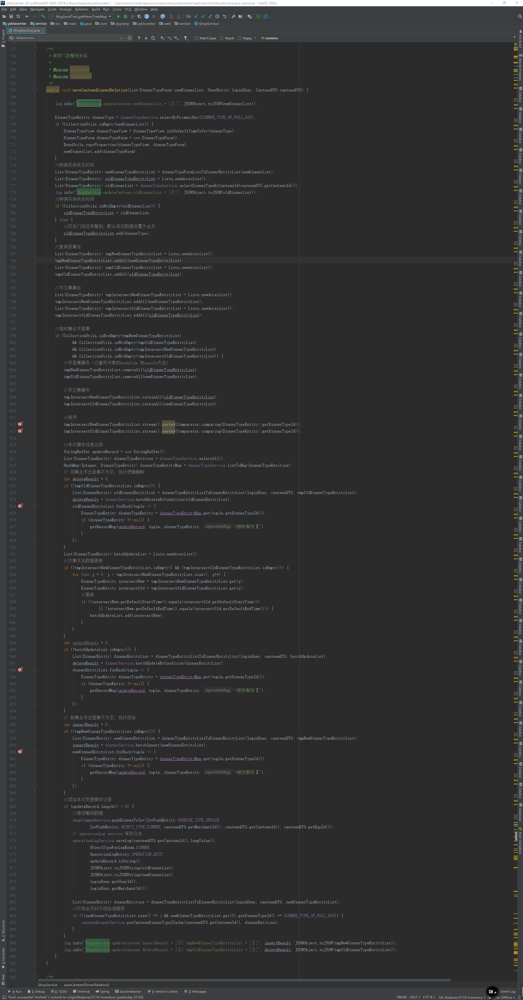
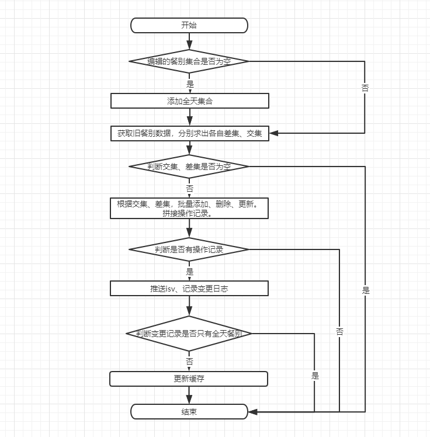

# 代码重构

## 介绍

质量好的代码，在结构上往往比较清晰容易阅读。但现实中，随着需求迭代等因素，导致代码变的臃肿，如下图：

_图(1)_

这样的代码不仅可读性差并且难以维护，还不便于测试。想象一下，上图的 130 行的代码，在进行单元测试时，有时可能都不知道程序运行时会得到什么样的结果，这就增加了编写桩代码的难度，并且代码覆盖率也难以保证。

所以本节将介绍，站在单元测试的角度，怎么针对臃肿代码进行优化。

## 业务场景

### [案例](https://github.com/xiyun-international/java-unit-docs/tree/master/source/middle-stage-test-optimization)

图 1 中是业务代码混乱的效果。结下了，为了便于你的理解，我以一个虚拟的业务`更新门店餐别`来讲解代码优化。

先来大致的了解一下业务逻辑：

- 数据为空，向集合中添加“全天”餐别。
- 处理新旧数据集合。获取各自的差集、交集。
- 集合不为空，批量添加，更新，删除。
- 产生变更记录，推送 ISV，保存日志。
- 集合中不包括“全天”更新缓存。



### [正确示范](https://github.com/xiyun-international/java-unit-docs/blob/master/source/middle-stage-test-optimization/src/main/java/com/middle/stage/test/optimization/service/impl/ShopServiceImpl.java)

- 根据不同功能、业务进行代码拆分。
- 拆分准则做到模块的输入输出可预测。
- 拆分后的模块独立测试。
- 上层业务，组织下层模块代码，测试业务时，模拟下层业务。

如下方展示的伪代码。

```java
public void operate(){
	//验证并设置基础数据
	baseData = validate();
	//得到新旧餐别数据集合，获取交集、差集
	data = processData(baseData);
	//批量添加
	batchInsert(data.insertList);
	//批量更新
	batchUpdate(data.updateList);
	//批量删除
	batchDelete(data.deLeteList);
	//更新缓存，推送数据，记录日志
	push();
}
```

### 优势

这些功能单一、规模较小的逻辑单元会有较大的复用性。在庞大的业务代码中总有一些代码由于耦合度较高，没办法复用。那么以这种提取方式，在今后的开发中，如果需要这些功能，就不用写重复的代码了。

```java
processData(){
	// 求差集
	getDifference();
	// 求交集
	getIntersection();
}
```

## 测试 Demo

[以下代码](https://github.com/xiyun-international/java-unit-docs/blob/master/source/middle-stage-test-optimization/src/main/java/com/middle/stage/test/optimization/commons/CommonsListUtil.java)拆分成可复用的工具类以后，它既可以独立的进行测试，也方便业务上的复用。

### 工具代码

```java
@Data
public class CommonsListUtil<T> {

    /**
     * 输入参数-新数据集合
     */
    private List<T> newObjectList;
    /**
     * 输入参数-旧数据集合
     */
    private List<T> oldObjectList;
    /**
     * 新集合求出的差集
     */
    private List<T> tmpNewObjectList;
    /**
     * 旧集合求出的差集
     */
    private List<T> tmpOldObjectList;
    /**
     * 新集合求出的交集
     */
    private List<T> tmpIntersectNewObjectList;
    /**
     * 旧集合求出的交集
     */
    private List<T> tmpIntersectOldObjectList;

    public CommonsListUtil(List<T> newObjectList, List<T> oldObjectList) {
        this.newObjectList = newObjectList;
        this.oldObjectList = oldObjectList;
    }

    public CommonsListUtil invoke() {
        //复制原集合
        tmpNewObjectList = Lists.newArrayList();
        tmpNewObjectList.addAll(newObjectList);
        tmpOldObjectList = Lists.newArrayList();
        tmpOldObjectList.addAll(oldObjectList);
        tmpIntersectNewObjectList = Lists.newArrayList();
        tmpIntersectNewObjectList.addAll(newObjectList);
        tmpIntersectOldObjectList = Lists.newArrayList();
        tmpIntersectOldObjectList.addAll(oldObjectList);

        //求差集操作（对象必须重写hashCode 和equals方法）
        tmpNewObjectList.removeAll(oldObjectList);
        tmpOldObjectList.removeAll(newObjectList);

        //求交集操作（对象必须重写hashCode 和equals方法）
        tmpIntersectNewObjectList.retainAll(oldObjectList);
        tmpIntersectOldObjectList.retainAll(newObjectList);
        return this;
    }
}
```

### 测试代码

```java
@Slf4j
@SpringBootTest
class MiddleStageTestOptimizationApplicationTests {

    private static List<DinnerTypeDO> newDinnerTypeDOList;
    private static List<DinnerTypeDO> oldDinnerTypeDOList;

    @BeforeAll
    static void beforeGetDinnerListTest() {
        newDinnerTypeDOList = new ArrayList<>();
        oldDinnerTypeDOList = new ArrayList<>();
        DinnerTypeDO d1 = new DinnerTypeDO(1, "早餐", 60, 120);
        DinnerTypeDO d2 = new DinnerTypeDO(2, "午餐", 120, 180);
        DinnerTypeDO d3 = new DinnerTypeDO(2, "午餐", 130, 180);
        DinnerTypeDO d4 = new DinnerTypeDO(3, "晚餐", 200, 250);
        newDinnerTypeDOList.add(d1);
        newDinnerTypeDOList.add(d2);
        oldDinnerTypeDOList.add(d3);
        oldDinnerTypeDOList.add(d4);
    }

    @Test
    void getDinnerListTest() {
        Assertions.assertNotNull(newDinnerTypeDOList, "newDinnerTypeDOList can not be null!");
        Assertions.assertNotNull(oldDinnerTypeDOList, "newDinnerTypeDOList can not be null!");
        //通用集合求差集、交集
        CommonsListUtil commonsListUtil = new CommonsListUtil(newDinnerTypeDOList, oldDinnerTypeDOList).invoke();
        //新集合求出交集
        List tmpIntersectNewObjectList = commonsListUtil.getTmpIntersectNewObjectList();
        //旧集合求出交集
        List tmpIntersectOldObjectList = commonsListUtil.getTmpIntersectOldObjectList();
        //新集求出合差集
        List tmpNewObjectList = commonsListUtil.getTmpNewObjectList();
        //旧集求出合差集
        List tmpOldObjectList = commonsListUtil.getTmpOldObjectList();

        Assertions.assertEquals(1, tmpIntersectNewObjectList.size());
        Assertions.assertEquals(1, tmpIntersectOldObjectList.size());
        Assertions.assertEquals(1, tmpNewObjectList.size());
        Assertions.assertEquals(1, tmpOldObjectList.size());
        log.info("tmpNewObjectList = [{}]", JSONObject.toJSONString(tmpNewObjectList));
        log.info("tmpOldObjectList = [{}]", JSONObject.toJSONString(tmpOldObjectList));
        log.info("tmpIntersectNewObjectList = [{}]", JSONObject.toJSONString(tmpIntersectNewObjectList));
        log.info("tmpIntersectOldObjectList = [{}]", JSONObject.toJSONString(tmpIntersectOldObjectList));

        //如果感兴趣，可以验证集合里的数据
        log.info("[测试通过]");
    }
}
```

### 运行结果

```java
2020-03-12 17:41:39.546  INFO 15924 --- [main] dleStageTestOptimizationApplicationTests : tmpNewObjectList = [[{"defaultEndTime":120,"defaultStartTime":60,"dinnerTypeId":1,"dinnerTypeName":"早餐"}]]
2020-03-12 17:41:39.547  INFO 15924 --- [main] dleStageTestOptimizationApplicationTests : tmpOldObjectList = [[{"defaultEndTime":250,"defaultStartTime":200,"dinnerTypeId":3,"dinnerTypeName":"晚餐"}]]
2020-03-12 17:41:39.547  INFO 15924 --- [main] dleStageTestOptimizationApplicationTests : tmpIntersectNewObjectList = [[{"defaultEndTime":180,"defaultStartTime":120,"dinnerTypeId":2,"dinnerTypeName":"午餐"}]]
2020-03-12 17:41:39.547  INFO 15924 --- [main] dleStageTestOptimizationApplicationTests : tmpIntersectOldObjectList = [[{"defaultEndTime":180,"defaultStartTime":130,"dinnerTypeId":2,"dinnerTypeName":"午餐"}]]
2020-03-12 17:41:39.547  INFO 15924 --- [main] dleStageTestOptimizationApplicationTests : [测试通过]

```

## 分享

最后给大家分享一篇文章 [35 个 Java 代码性能优化总结](https://wenku.baidu.com/view/d865624053d380eb6294dd88d0d233d4b14e3f30.html)。请根据工程的实际业务场景，参考这些优化点。
